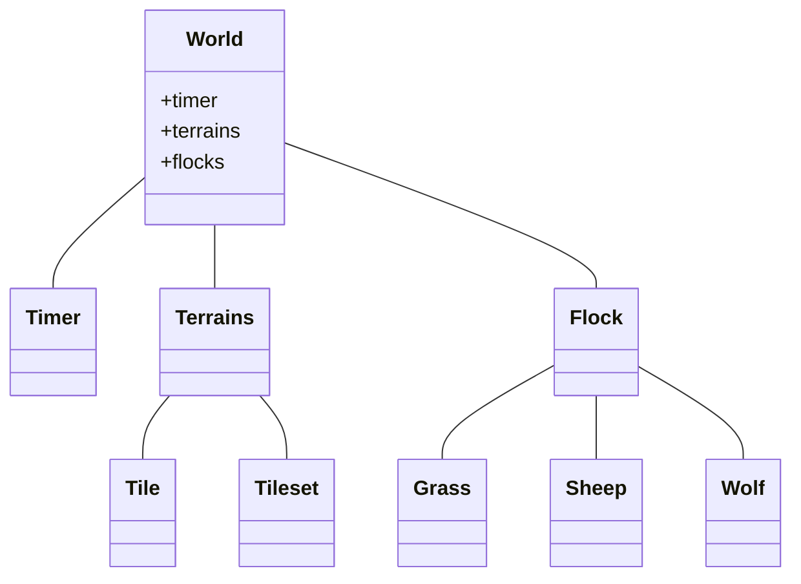
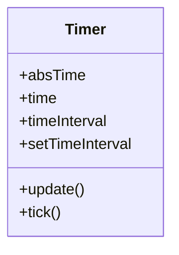
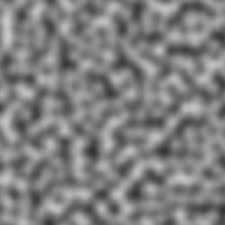
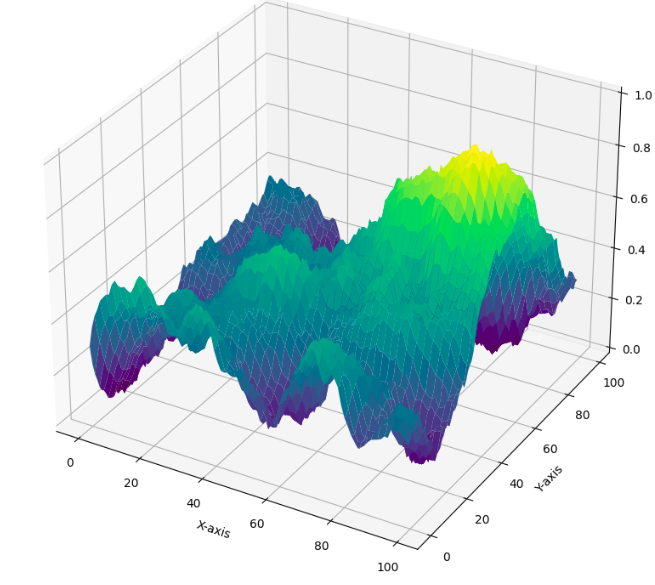
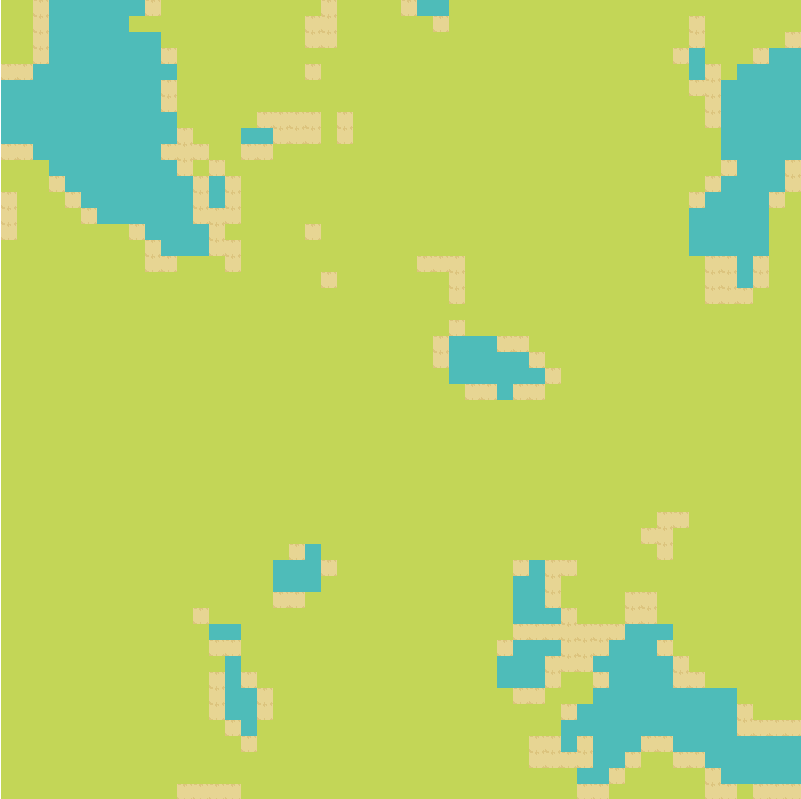
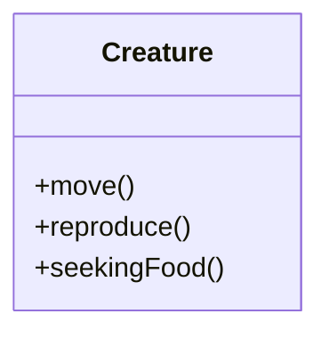
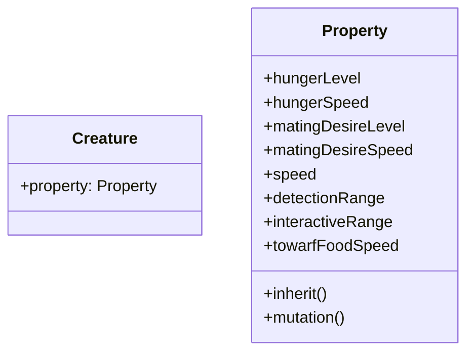
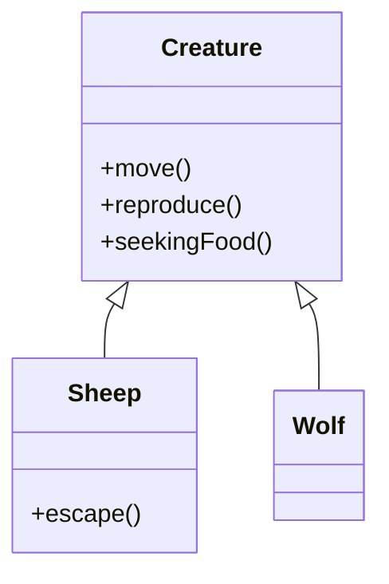
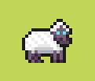
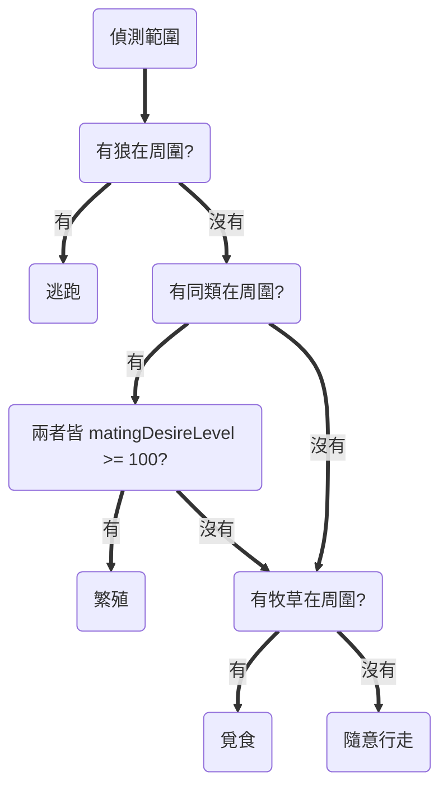

# 人工智慧導論期末報告 

## 主題

這一個程式碼的主題是生態系統模擬，模擬生物在環境中覓食、繁殖的行為。

## 契機

由於本組於期中的康威生命遊戲，選擇的題目是基於康威生命遊戲的基本規則上，加入另一個族群與自訂的互動關係，達到模擬兩族群的互動，包含同族群之間的資源競爭與繁殖行為、異族群之間的掠食者與獵物關係。但我們所使用的康威生命遊戲之規則相對簡單，無法模擬細節，故希望做出能夠呈現兩群體更詳細的互動過程，模擬上述同族群間與異族群間的行為與互動。 

此次模擬將先隨機生成地形，包含草地，水坑以及水坑旁的沙地。而地圖中主要有三種物件，包含狼、羊以及羊所吃的草。物件的草將在草地中隨機生成一定數量給羊吃，而狼與羊使用者決定投放的位置與數量，而每隻狼與羊皆有屬於自己的生物參數，而生物參數是牠們行為的重要依據，包含飢餓值、繁殖衝動量值、移動速度、生物及食物的偵測範圍等，生物參數與生物的行為互相影響，而模擬出彼此的互動關係。 


## 實作方法

### ``程式架構``

- **World**: 所有的生態模擬有關的物件都放置在這裡面
- **Timer**: 用來計時World中的時間
- **Terrains**: 世界中的地圖資料都儲存在裡面
- **Flock**: 儲存世界中各個生物的群體



### ``時間``

透過計時器(timer)調整每一次資料更新的次數間隔來加快或減慢世界的運行速度。




### ``地形生成``

模擬生態除了生物以外，另一個重要的要素是環境，環境的部份其中包含了地形及糧食生成。首先是地形的部份，而在這邊使用的方法是透過柏林噪聲(Perlin noise)的一種隨機噪聲生成演算法來生成，得到的一個具有自然紋理和隨機性的圖形的二維陣列。

下面是視覺化柏林噪聲產生的二維陣列



而這一個是立體空間中的柏林噪聲生成的圖形，外觀就像現實中的地形圖一樣。



在實作的部份，我使用python提供的套件"perlin_noise"來實現柏林噪聲的功能。
我在程式碼中得到的一組包含[-1.0, 1.0]的二維陣列資料，並將其歸一化至[0.0, 1.0]。

接著原本得到的二維陣列資料中每一個資料以[0.0, 0.3), [0.3, 0.35), [0.35, 1.0]三個部份來做區隔，在0.0~0.3之間會得到水地、0.3~0.35會得到沙土及0.35~1.0會到草地，以上這三種地貌。

以下是地形對生物造成的影響：
- 水地: 生物移動速度降低，降低至生物自身移動速度的0.75倍

- 沙土: 無任何影響

- 草地: 會生長出牧草




### ``隨機生成的糧食``

- 牧草

    在地圖上任何位置會隨時間隨機生長一定數量的牧草給綿羊吃

    - 可以設定其每次生長的間隔時間，以及每次的生長數量

  

### ``生物``

#### - 生物基本行為


定義的生物基本行為有以下三種：


- 隨機移動: 隨時間移動及改變方向
- 覓食: 偵測到食物則向食物的方向跑去
- 繁殖: 符合繁殖條件時進行繁殖，誕生新生命

以下是在實作上生物類別。



  - 移動(move):

    透過隨機數得到一個方向的單位向量，當作生物移動的方向。並隨機時間隔決定多久讓生物更換方向。

  - 繁殖(reproduce):

    當生物的繁殖衝動達到臨界值時，計算週邊同類的距離，當距離小於偵測範圍，並且欲交配對象的繁殖衝動也同樣達到臨界值時，則雙方進行繁殖。

  - 覓食(seekingFood):
    計算週邊食物的距離，當計算的距離小於偵測範圍時，則朝向食物的方向前進。


#### - 生物參數


首先，定義的生物類別中的重要參數如下：

- hungerLevel: 生物的飢餓值，會隨著時間而降低，低於0時生物死亡 
- hungerSpeed: 飢餓值隨時間改變的變化量
- matingDesireLevel: 繁殖衝動水平的量值，隨時間增加，達到閾值時可以進行繁殖
- matingDesireSpeed: matingDesireLevel的增長隨時間增加的變化量
- speed: 生物的移動速度
- detectionRange: 偵測週邊生物的範圍
- interactiveRange: 開始進行覓食、繁殖的互動範圍
- towarfFoodSpeed: 朝向食物的移動速度

以下是程式實作時的物件。

  - Propert 上述的生物參數的內容都涵蓋在裡面
  - inherit(): 
  
    生物進行繁殖行為後，其後代的相關參數會透過這一個方法來計算處理，在這邊只針對"hungerSpeed", "matingDesireSpeed", "speed", "detectionRange",
    "towardFoodSpeed"，這四項進行計算，其餘都維持父方或母方的數據。

    處理方式是從父方或母方隨機抽取其中一方的參數，並透過mutation()中的方法來得到新的參數，最後將參數繼承到後代之中。
  
  - mutation():

    將得到的數值作為高斯分佈中的mu值，sigma值為mu值除以自己設定的常數(這邊是sigma = mu / 10)，最後得到一個新的數值傳遞回去。
    

    



#### - 生物種類

在這邊我們設定了兩個生物群體 - 綿羊與狼。



- **綿羊**
  
  以牧草為食的動物，其可執行的行為多了"逃跑"，偵測到狼在周圍時則開始逃離


  

  - 綿羊的行為決策



- **狼**

  以綿羊為捕食對象的動物

  ```mermaid
  flowchart

  b1(隨機移動)
  b2(覓食)
  b3(繁殖)
  ```

  


- 狼的行為決策
  ```mermaid
  flowchart TD
  t1(偵測範圍) 

  t1 ==> cond2(有同類在周圍?)

  cond2 ==有==> cond3(兩者皆 matingDesireLeve >= 100?)
  cond3 ==有==> r2(繁殖)
  cond3 ==沒有==> cond4(有綿羊在周圍?)

  cond4 ==有==> r3(狩獵)
  cond4 ==沒有==> r4(隨意行走)

  cond2 ==沒有==> cond4
  ```

## 環境建立與執行方式

使用python版本為3.8.10

- 需安裝的套件:
  - numpy
  - pygame
  - perlin_noise

安裝指令:
```
pip install -r requirements.txt
```

執行src資料中的main.py

## 操作方式
執行遊戲後可按下P鍵暫停遊戲來進行布局。

操作按鍵細節:
- R按鍵: 重置遊戲
- P按鍵: 暫停遊戲
- Q按鍵: 離開遊戲
- 左鍵: 放置狼
- 右鍵: 放置猴子
- Tab按鍵: 顯示當前生物及糧食數量
- S按鍵: 顯示生物偵測及互動範圍
- 上、下、左、右按鍵: 移動視窗畫面


## 參考資料

- [Coding Adventure: Simulating an Ecosystem](https://www.youtube.com/watch?v=r_It_X7v-1E&t=160s)

- [Making maps with noise functions](https://www.redblobgames.com/maps/terrain-from-noise/)

- [Perlin Noise wiki](https://en.wikipedia.org/wiki/Perlin_noise)

- [牧草素材連結](https://bowpixel.itch.io/low-grass-set)

- [動物素材連結](https://deepdivegamestudio.itch.io/animalassetpack)

- [地形素材連結](https://merchant-shade.itch.io/16x16-mini-world-sprites)